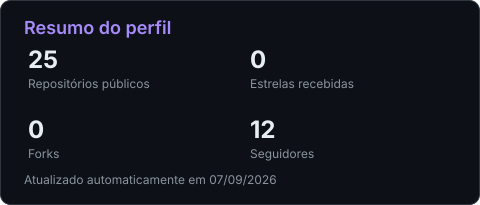
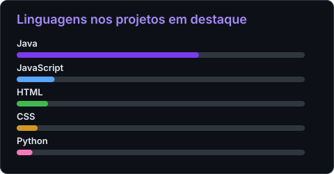

<h1 align="center">Olá, eu sou o Samuel Santos! 👋</h1>

<p align="center">
  <a href="https://git.io/typing-svg">
    
  </a>
</p>

<p align="center">
  
</p>

<p align="center">
  Transformo dados e ideias em soluções úteis, unindo desenvolvimento de software, análise e visualização de informações.
</p>

<p align="center">
  <a href="https://www.linkedin.com/in/samuel-santos20/">
    
  </a>
  <br />
  <a href="https://www.instagram.com/_samusm_/">
    
  </a>
  <a href="mailto:samuelfamilia377@gmail.com">
    
  </a>
</p>

---

## Sobre mim

```java
public class Samuel extends Developer {
    String nome = "Samuel Santos Miranda";
    String area = "Desenvolvimento de Software e Dados";
    String foco = "Java, Python, SQL e Business Intelligence";
    String formacao = "Análise e Desenvolvimento de Sistemas — UniCarioca";

    String[] interesses = {
        "APIs REST", "Arquitetura de Software",
        "Bancos de Dados", "Segurança"
    };
}
```

- 🎓 Formação em **Análise e Desenvolvimento de Sistemas** pela UniCarioca
- ☕ Desenvolvimento backend com **Java, Spring Boot e APIs REST**
- 📊 Análise e tratamento de dados com **Python, Pandas e SQL**
- 📈 Criação de dashboards e relatórios para apoio à decisão com **Power BI e Metabase**
- 🧩 Experiência prática em integração de dados, sistemas de gestão e aplicações web
- 🚀 Sempre estudando novas tecnologias e aprimorando boas práticas de desenvolvimento

## Experiências

<table>
  <tr>
    <td width="100" align="center">
      
    </td>
    <td>
      <strong>Analista de Dados — Estágio</strong><br />
      <a href="https://www.marinha.mil.br/">Marinha do Brasil</a> • mai de 2026 — atualmente<br /><br />
      Atuação no Departamento de Gestão de Custos, apoiando análises e a tomada de decisão. Trabalho com tratamento de dados em JSON, CSV e Excel; criação de dashboards e relatórios com Power BI e Metabase; e limpeza, organização e integração de bases usando Python, Pandas e SQL.
    </td>
  </tr>
  <tr>
    <td width="100" align="center">
      
    </td>
    <td>
      <strong>Estagiário de Dados e Software</strong><br />
      <a href="https://www.gov.br/inss/pt-br">INSS</a> • mar de 2024 — mar de 2026<br /><br />
      Apoio ao desenvolvimento e à manutenção de soluções internas, análise de sistemas em uso, suporte a ferramentas eletrônicas e orientação ao público. Também participei de diagnósticos e ajustes em redes de dados e comunicação.
    </td>
  </tr>
  <tr>
    <td width="100" align="center">
      
    </td>
    <td>
      <strong>3º lugar — ROBLOX Jam for Change</strong><br />
      <a href="https://www.iea.usp.br/">Instituto de Estudos Avançados da USP</a> • mar a abr de 2026<br /><br />
      Com minha equipe, desenvolvi o jogo educacional <strong>Reignite</strong>. Atuei como programador, estruturando as mecânicas em Lua no Roblox Studio. O projeto conquistou o 3º lugar, foi certificado pelo IEA‑USP, Roblox e Games for Change América Latina e recebeu uma premiação de US$ 500.
    </td>
  </tr>
</table>

## Tecnologias

### Linguagens

<p>
  
</p>

### Backend e dados

<p>
  
</p>

### Ferramentas e ambiente

<p>
  
</p>

## Projetos em destaque

| Projeto | Descrição | Tecnologias |
| --- | --- | --- |
| [Library API](https://github.com/SamuelSantos20/library-api) | API para gerenciamento de biblioteca | Java, Spring Boot |
| [Time Sheet](https://github.com/SamuelSantos20/time-sheet) | API para controle de ponto empresarial | Java, Spring Boot |
| [Finanças Municipais da Baixada](https://github.com/SamuelSantos20/financas-municipais-baixada) | Pipeline para extração e análise de dados fiscais públicos dos municípios da Baixada Fluminense | Python, Pandas, Requests, SICONFI API |
| [Game Synopsis](https://github.com/SamuelSantos20/game_synopsis) | API para catálogo e organização de jogos em listas personalizadas | Java, Spring Boot, PostgreSQL, MapStruct, Liquibase, Docker, Swagger |
| [Stock Management System](https://github.com/SamuelSantos20/Stock_Management_System) | Sistema web para controle de estoque | Java, Spring Boot, Spring Security, MySQL, Thymeleaf |
| [Corporate Manager](https://github.com/SamuelSantos20/Corporate_Manager) | Gestão de cargos, departamentos e funcionários | Java, Spring Boot, Thymeleaf |

## Estatísticas do GitHub

<div align="center">
  
  
</div>

<p align="center">
  <sub>Cartões armazenados no próprio repositório e atualizados automaticamente pelo GitHub Actions.</sub>
</p>

---

<p align="center">
  Vamos conversar sobre tecnologia, projetos e oportunidades? Entre em contato pelo
  <a href="https://www.linkedin.com/in/samuel-santos20/">LinkedIn</a>.
</p>
